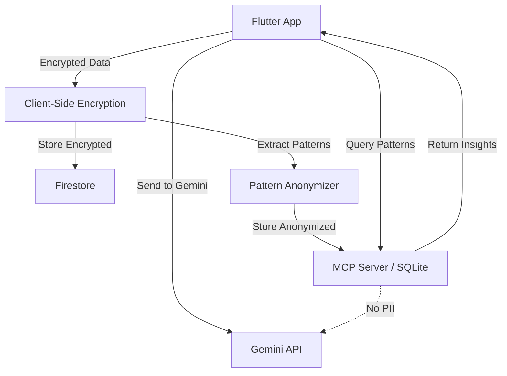

# MindFlow MCP (Model Context Protocol) Server Architecture

## Executive Summary

The MCP server provides MindFlow's "long-term memory" - a privacy-preserving behavioral research database that enables the AI to recall user patterns without violating zero-knowledge principles.

**The Challenge:** How do we give Gemini AI memory of past insights while keeping psychological data client-side encrypted?

**The Solution:** Local MCP server that stores anonymized behavioral patterns (not raw data) and serves as a privacy-compliant knowledge bridge.

## Architecture Overview



## Key Principles

### 1. Privacy-First Design

**What Gets Stored in MCP:**

- ✅ "User tends to enter flow between 9-11am" (temporal pattern)
- ✅ "Meditation correlates with 40% higher focus score" (correlation)
- ✅ "Visual learner (82% confidence)" (VAK profile)

**What NEVER Gets Stored:**

- ❌ Raw psychological assessments
- ❌ Actual conversation transcripts
- ❌ Personally identifiable information (PII)
- ❌ Unencrypted emotional data

### 2. Pattern Extraction vs. Raw Data

**The Math:**

```
Raw Data (Encrypted) → Pattern Extractor → Anonymized Insights
```

**Example:**

- **Raw:** "I feel anxious about the presentation tomorrow"
- **Pattern:** `anxiety_trigger: work_presentation, frequency: 3/week`
- **Stored in MCP:** `work_presentations → elevated_stress_marker`

### 3. GDPR/HIPAA Compliance

**GDPR Article 17 (Right to Erasure):**

- MCP supports full pattern deletion
- User can request: "Forget everything about me"
- Both encrypted data AND patterns erased

**HIPAA §164.502:**

- Minimum necessary standard: only pattern summaries, not full records
- De-identification safe harbor: no 18 identifiers stored

## Technical Specification

### MCP Server Stack

**Option 1: Dart-based MCP Server (Preferred)**

- Written in Dart for consistency with Flutter app
- Runs as local background service
- SQLite database for pattern storage
- JSON-RPC protocol for Flutter ↔ MCP communication

**Option 2: Python-based MCP Server**

- Python FastAPI server (localhost only)
- Pandas for pattern analytics
- scikit-learn for correlation detection
- More ML libraries available

### MCP Client (Flutter)

```dart
/// MCP Client Service
/// Communicates with local MCP server for pattern retrieval
class MCPClientService {
  final String _serverUrl = 'http://localhost:7777';

  /// Queries behavioral patterns without exposing raw data
  Future<List<BehavioralPattern>> queryPatterns({
    required String userId,
    required PatternType type,
  }) async {
    // MCP protocol: resource-based retrieval
    final response = await http.get(
      Uri.parse('$_serverUrl/patterns/$userId/$type'),
    );

    return _parsePatternsResponse(response.body);
  }

  /// Stores new anonymized pattern (after extraction)
  Future<void> storePattern(BehavioralPattern pattern) async {
    await http.post(
      Uri.parse('$_serverUrl/patterns'),
      body: jsonEncode(pattern.toJson()),
    );
  }
}
```

### Pattern Storage Schema

**SQLite Tables:**

```sql
-- User pattern summary (no PII)
CREATE TABLE user_patterns (
  id TEXT PRIMARY KEY,
  user_id_hash TEXT NOT NULL,  -- Hashed, not raw
  pattern_type TEXT NOT NULL,   -- 'flow_window', 'stress_trigger', etc.
  pattern_data JSON NOT NULL,   -- Anonymized pattern details
  confidence REAL,              -- 0.0-1.0
  created_at INTEGER,
  updated_at INTEGER
);

-- Flow state patterns
CREATE TABLE flow_patterns (
  id TEXT PRIMARY KEY,
  user_id_hash TEXT NOT NULL,
  hour_of_day INTEGER,          -- 0-23
  day_of_week INTEGER,          -- 0-6
  flow_probability REAL,        -- Historical flow % at this time
  sample_size INTEGER,
  created_at INTEGER
);

-- Habit correlations
CREATE TABLE habit_correlations (
  id TEXT PRIMARY KEY,
  user_id_hash TEXT NOT NULL,
  habit_name TEXT,              -- e.g., "meditation", "exercise"
  outcome_metric TEXT,          -- e.g., "focus_score", "cognitive_load"
  correlation_coefficient REAL, -- -1.0 to 1.0
  sample_size INTEGER,
  created_at INTEGER
);
```

## Data Flow

### 1. User Creates Data (Flutter App)

```dart
// User logs meditation session
await logHabit(type: 'meditation', duration: 10);

// Encrypted and stored in Firestore
await encryptionService.encryptAndStore({
  'type': 'meditation',
  'duration': 10,
  'timestamp': DateTime.now(),
});
```

### 2. Pattern Extraction (Background Process)

```dart
// Periodic background job (daily)
Future<void> extractPatternsFromEncryptedData() async {
  // 1. Decrypt local data
  final decryptedLogs = await decryptLocalCache();

  // 2. Extract patterns (math, no PII)
  final patterns = PatternExtractor().analyze(decryptedLogs);
  // patterns: "Meditation → +40% focus score correlation"

  // 3. Send anonymized patterns to MCP
  await mcpClient.storePattern(patterns);

  // 4. Delete decrypted cache (no persistence)
  await deleteTempData();
}
```

### 3. AI Retrieval (Coaching Session)

```dart
// Gemini needs context about user's peak flow time
final flowPatterns = await mcpClient.queryPatterns(
  userId: currentUser.id,
  type: PatternType.flowWindows,
);

// flowPatterns: ["9-11am: 78% flow probability", "8-9pm: 65%"]

// Send to Gemini (no PII, just patterns)
final prompt = '''
User's historical flow windows: ${flowPatterns.join(', ')}
Current time: 10:00am
Task: Deep work session

Recommendation:
''';

final response = await gemini.generateContent(prompt);
```

## Security Measures

### 1. Localhost-Only Server

```dart
// MCP server binds to 127.0.0.1 ONLY
// No external network access
final server = await HttpServer.bind(
  InternetAddress.loopbackIPv4,  // 127.0.0.1
  7777,
);
```

### 2. User ID Hashing

```dart
// Never store raw user IDs
String hashUserId(String userId) {
  return sha256.convert(utf8.encode(userId)).toString();
}
```

### 3. Automatic Expiration

```dart
// Patterns auto-delete after 90 days (configurable)
// User can override: "Remember forever" or "Forget after 30 days"
const defaultRetentionDays = 90;
```

### 4. User-Controlled Erasure

```dart
// GDPR Art. 17: Right to be forgotten
Future<void> eraseAllUserData(String userId) async {
  final hashedId = hashUserId(userId);

  // Delete from MCP database
  await mcpClient.deleteAllPatterns(hashedId);

  // Delete encrypted Firestore data
  await firestore.collection('users').doc(userId).delete();

  // Destroy encryption keys
  await encryptionService.destroyKey();
}
```

## MCP Protocol Resources

### Available Resources

```
/patterns/{userId}/flow_windows
/patterns/{userId}/habit_correlations
/patterns/{userId}/stress_triggers
/patterns/{userId}/vak_profile
/patterns/{userId}/cognitive_load_trends
```

### Example MCP Response

```json
{
  "resource": "flow_windows",
  "user_id_hash": "7a8b9c...",
  "patterns": [
    {
      "time_window": "09:00-11:00",
      "flow_probability": 0.78,
      "sample_size": 42,
      "confidence": 0.85
    },
    {
      "time_window": "20:00-21:00",
      "flow_probability": 0.65,
      "sample_size": 28,
      "confidence": 0.72
    }
  ],
  "metadata": {
    "last_updated": "2026-02-02T18:00:00Z",
    "retention_days": 90
  }
}
```

## Implementation Roadmap

### Week 1: MCP Server Foundation

- [x] MCP protocol research
- [ ] Dart MCP server skeleton
- [ ] SQLite schema implementation
- [ ] Basic CRUD operations

### Week 2: Pattern Extraction

- [ ] Pattern anonymization algorithms
- [ ] Correlation calculator
- [ ] Flow window analyzer
- [ ] Habit-outcome correlator

### Week 3: Flutter Integration

- [ ] MCP client service
- [ ] Background pattern extraction job
- [ ] Gemini prompt augmentation with MCP data
- [ ] User settings for data retention

### Week 4: Privacy & Compliance

- [ ] User ID hashing
- [ ] Retention policy enforcement
- [ ] GDPR erasure workflow
- [ ] Security audit

## Privacy Guarantees

1. **Server Never Sees Raw Data:** Gemini receives patterns, not psychological assessments
2. **Local-Only Storage:** MCP server is localhost, unreachable from internet
3. **User Control:** Full deletion, retention settings, opt-out available
4. **Anonymization:** Even MCP patterns don't contain PII
5. **Encrypted Transit:** Flutter ↔ MCP communication over TLS (localhost TLS)

## Example Use Case

**Scenario:** User wants AI to remember past breakthrough insights

**Traditional Approach (Privacy Violation):**

```
Gemini's context: "Last week you said: 'I realized procrastination is fear of judgment...'"
Problem: Raw conversation stored server-side
```

**MindFlow MCP Approach:**

```
Gemini's context: "Pattern analysis shows 'fear of judgment' correlates with procrastination episodes."
How: MCP extracted correlation, forgot exact words
```

**Result:** Same coaching effectiveness, zero privacy compromise.

## Conclusion

The MCP architecture solves MindFlow's paradox: **How to give AI memory without violating zero-knowledge encryption.**

By storing patterns instead of data, we achieve:

- ✅ Personalized long-term coaching
- ✅ GDPR/HIPAA compliance
- ✅ Zero-knowledge architecture
- ✅ User trust and transparency
